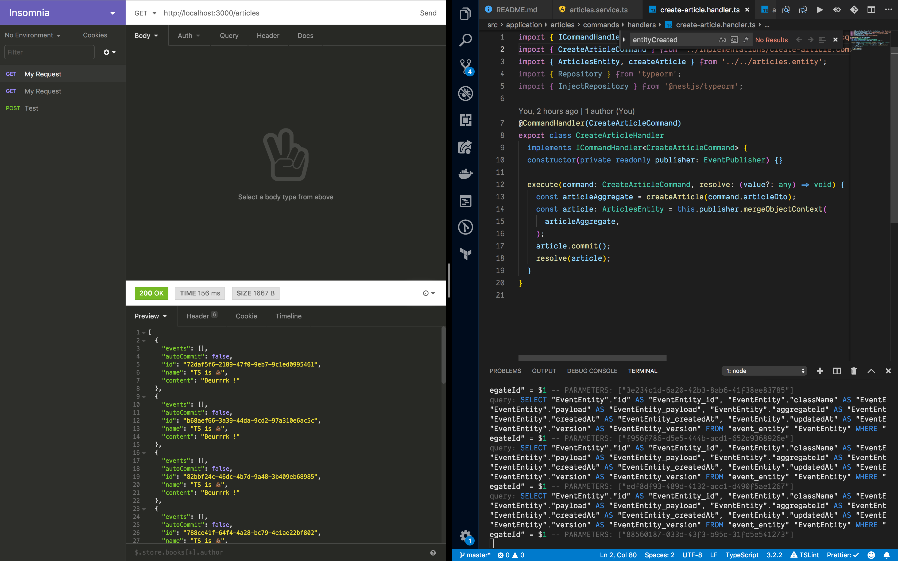

# Blog Croute

This is a Dojo (hackathon) to learn CQRS and event sourcing using nets.js

## Credits

Samox/dojo-event-sourcing-cqrs

## Tello

[Trello link](https://trello.com/b/yrG5pLaO/event-sourcing-cqrs)

## Next

If that is usefull to you, thanks [Sammy Teillet](https://twitter.com/sammyteillet) on Twitter.
